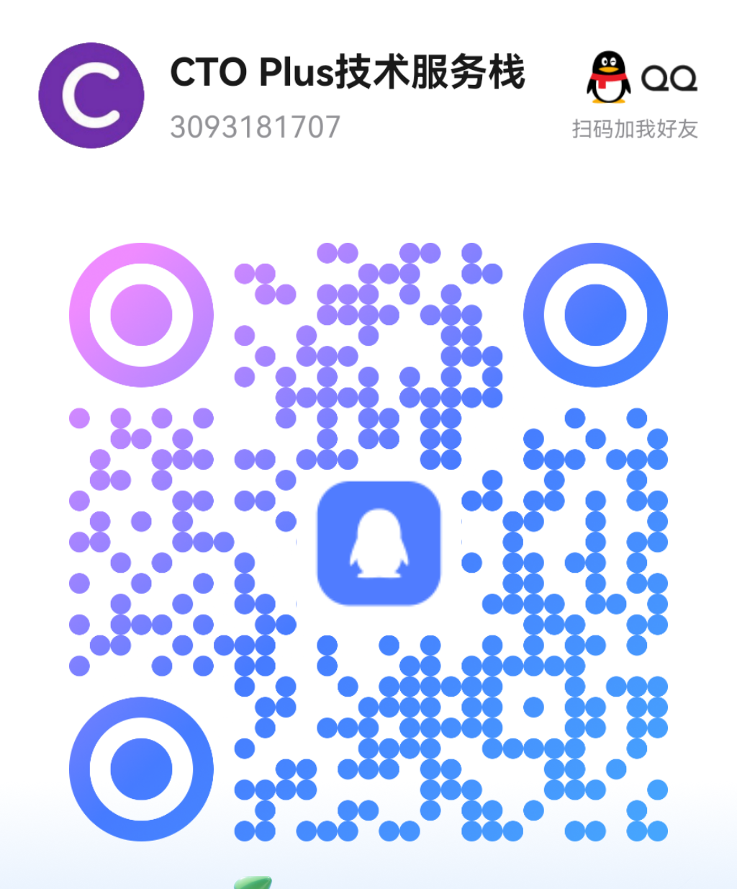
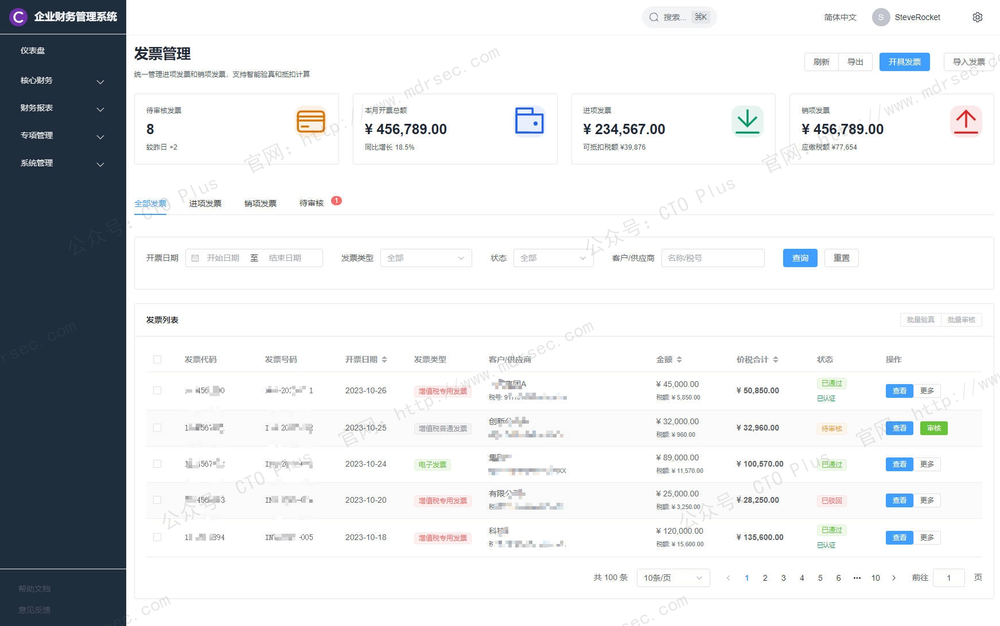
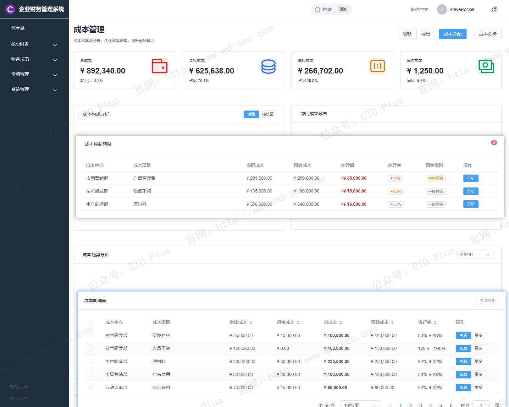
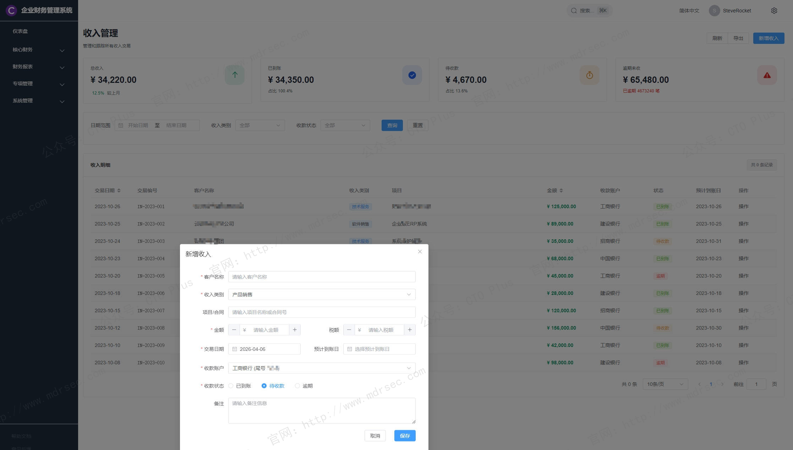
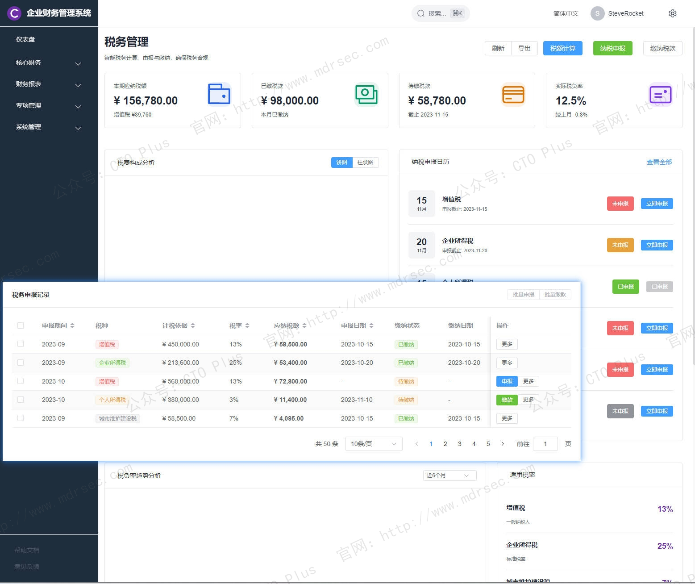
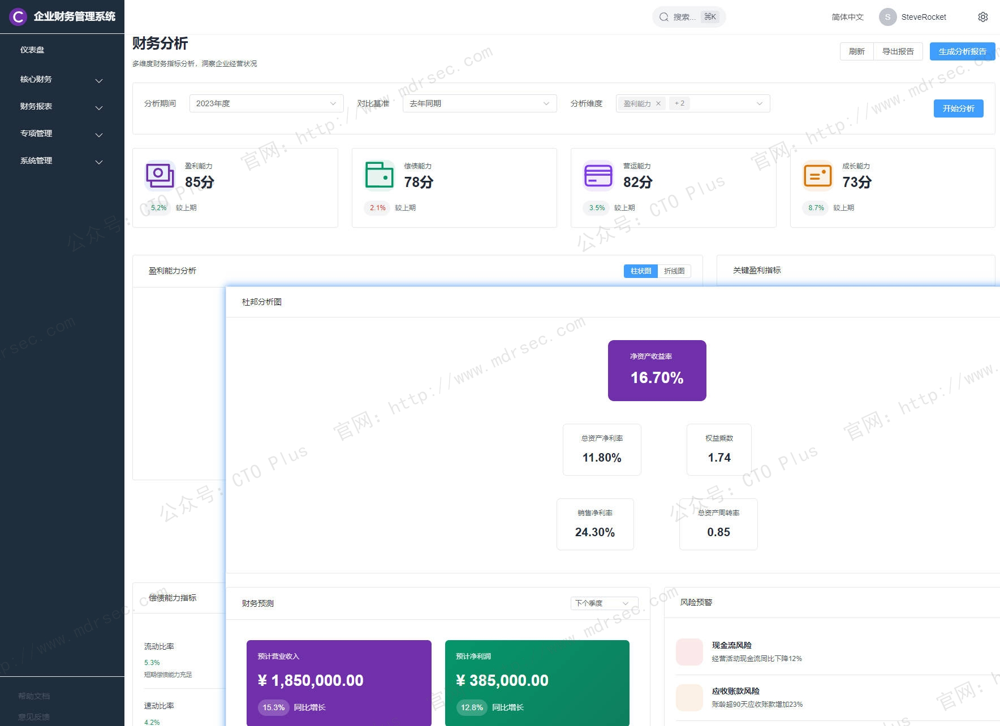
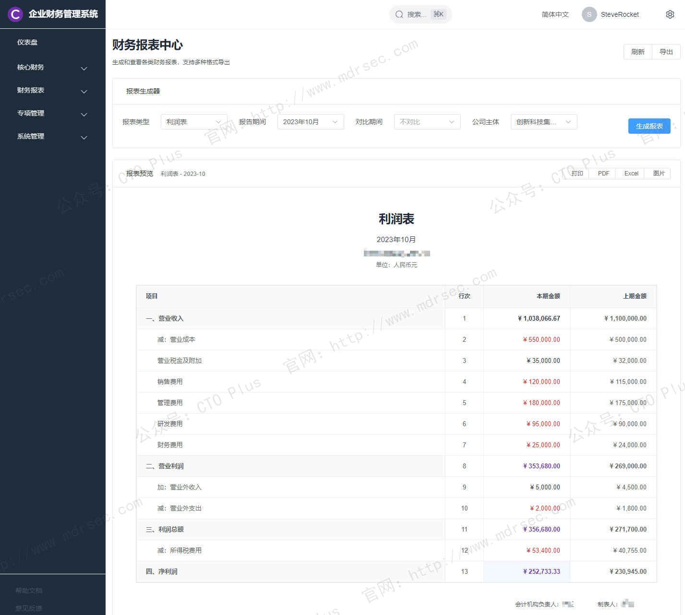
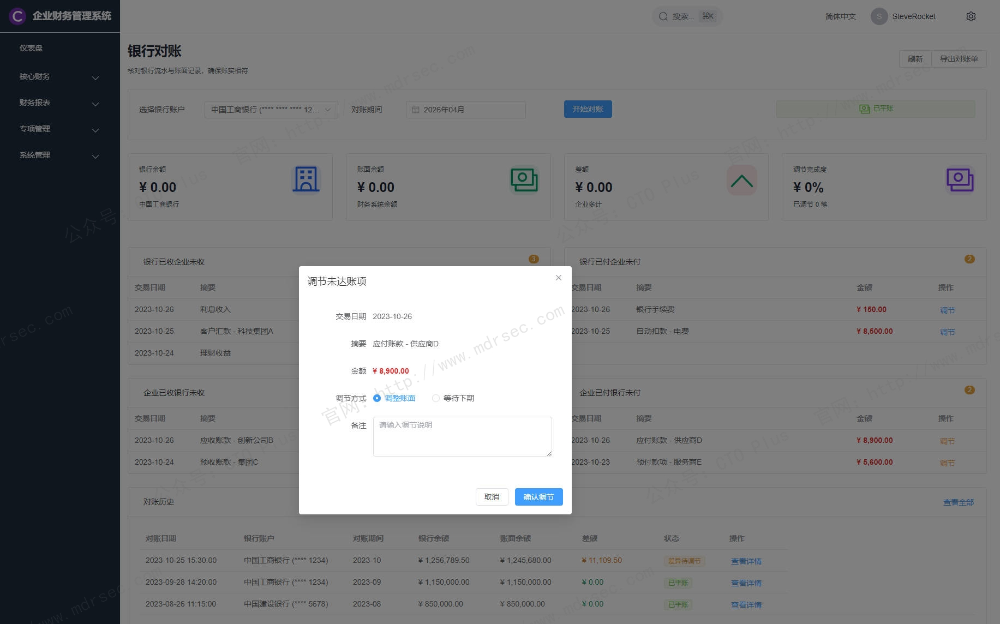
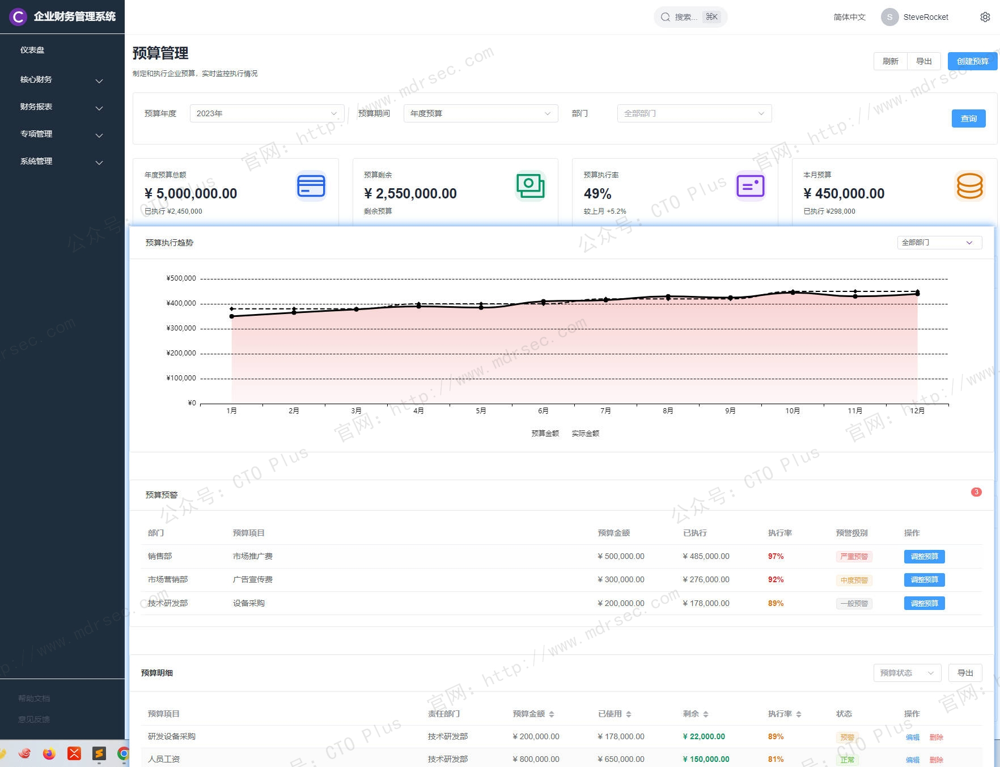

# 企业财务管理系统（FMS）

## 关于我们

- 官网： http://www.mdrsec.com

我们的技术文章和产品概述欢迎浏览我们的门户。

- 公众号：CTO Plus

最新的动态欢迎关注我们官方唯一公众号。

- 作者QQ

更详细更具体的需求，或者项目合作，或者问题 欢迎联系我。

- QQ群

我们官方组建的QQ群，如果您有兴趣也可以加入我们。

- 请喝咖啡

如果感兴趣，也可以请我喝杯咖啡

## 产品核心功能模块

我们自研的财务系统作为**业财连接器**、**效率加速器**与**决策赋能器**的综合能力。对于中小企业，轻量化、全功能的SaaS（软件即服务）云财务是首选，能以较低成本获取先进能力；对于大型集团，应重点考察系统的**高并发处理能力**、**全球化架构**与**PaaS平台扩展性**。

将是数据驱动的智慧中心——财务人员不再只是“账房先生”，而是通过FMS洞察业务增长机会、管控经营风险的价值创造者 。

这里介绍下我们自研的企业级财务管理系统（FMS）的核心功能与关键特性：

## 一、 定位与架构

在数字化转型的浪潮中，企业级财务管理系统（FMS）的定义已发生根本性转变。它不再是孤立的后台会计软件，而是连接业务、资金与决策的**智能中枢**。一套现代化的FMS必须具备**业财融合**的底层架构，打破传统ERP中业务与财务的数据孤岛，实现从销售订单、采购入库到费用报销的全链路数据贯通 。

从架构层面看，FMS正从单体应用向**财务中台**或**微服务架构**演进。核心特征在于**可组装性**与**高扩展性**：企业可以根据业务复杂度按需选择总账、资金、预算等模块，并通过开放的API接口与CRM（客户关系管理系统）、SRM（供应商关系管理系统）、OA（办公自动化系统）等外部系统无缝对接 。例如，现代FMS应具备动态会计引擎，能够根据预设规则将业务单据（如销售出库单）自动转化为记账凭证，确保账实相符与数据同源。

## 二、 核心功能模块：贯穿资金流转全周期的功能矩阵
一套成熟的企业级FMS应包含以下八大核心功能模块，覆盖核算、管理、决策与合规四个维度：

| **功能维度** | **核心模块** | **关键业务价值** |
| :--- | :--- | :--- |
| **核算与合规** | 智能总账与报表、税务合规引擎 | 实现99%+自动凭证生成率，降低人工差错与合规风险，确保账目清晰合规。  |
| **资金与资产** | 资金与司库管理、资产管理 | 实时监控全球资金流向与头寸，提升资产全生命周期使用效率，优化现金流预测。  |
| **控制与分析** | 全面预算控制、管理会计与成本 | 实现事前预算控制与事中预警，通过多维盈利分析驱动业务决策与降本增效。  |
| **战略与协同** | 合并报表与绩效、财务共享服务 | 自动化处理多组织复杂的股权抵消与合并，支撑集团战略管控与标准化流程共享。  |

### 1. 智能核算与总账管理
这是FMS最基础也是最进化的模块。核心能力包括：
- **多准则多账簿体系**：支持企业同时维护中国会计准则（CAS）、国际财务报告准则（IFRS）等多套账务，自动完成调整与转换，满足全球化上市合规需求 。
- **智能记账与RPA机器人**：通过OCR（光学字符识别）发票识别、银行回单匹配及RPA（机器人流程自动化）技术，将手工录入凭证的效率提升70%以上。系统自动完成折旧计提、汇率评估、期末调汇与损益结转，将结账周期从天级压缩至小时级 。
- **全链路业务追溯**：支持从财务报表穿透钻取至原始业务单据，确保审计轨迹完整可追溯。

### 2. 资金管理与全球司库
资金是企业的血液，该模块重点解决资金可视、可控与增值问题：
- **银企直连与智能对账**：直连全球银行系统，实时获取账户余额与交易流水，自动完成银行对账单与企业日记账的勾兑。某零售企业通过该功能将每月对账周期从5天压缩至1小时 。
- **资金池与流动性预测**：支持集团资金的上划下拨与统一调配。结合历史回款周期与未来付款计划，AI模型可自动生成未来3-6个月的现金流预测曲线，辅助投融资决策 。
- **信用与风控管理**：对客户与供应商进行信用评级，自动计算账龄并触发催收或付款提醒，有效控制坏账风险 。

### 3. 全面预算与费用控制
超越传统的Excel填报模式，构建PDCA（计划-执行-检查-行动）的预算闭环管理：
- **多维预算编制**：支持零基预算、滚动预算与弹性预算模型。可实现按部门、项目、产品线甚至个人维度的额度分解 。
- **事前与事中控制**：与采购、报销系统联动。例如，在提交差旅申请时自动校验剩余预算，超预算单据无法提交审批，将事后分析转为事中控制。某制造企业借此将销售费用超支率降低了90% 。
- **预算预测模拟**：基于大数据能力，模拟不同业务场景（如原材料涨价20%）对损益的影响，辅助战略动态调整 。

### 4. 管理会计与成本精细化
区别于对外披露的财务会计，该模块服务于内部降本增效：
- **多维度获利分析**：支持按客户、订单、渠道、产品线等维度分摊成本与收入，精准计算单品毛利与客户贡献度，识别隐性亏损业务 。
- **精细化成本核算**：针对制造业，支持按工序、工单的实际成本法与标准成本法对比分析，精准定位成本差异动因。某企业引入后单件成本核算效率提升80% 。

### 5. 税务合规引擎
应对全球复杂的税务监管环境，FMS需内置强大的规则引擎：
- **全税种自动计算与申报**：覆盖增值税、所得税、附加税等，自动适配最新税收优惠政策，生成符合电子税务局接口标准的申报表，实现一键报税 。
- **票税风控**：实时校验发票真伪与抬头合规性，对增值税进销项匹配度、税负率异常波动进行预警，规避金税系统下的稽查风险 。

### 6. 合并报表与绩效管理
针对大型集团企业，解决“一张表”难题：
- **复杂股权自动抵消**：支持多层级的股权架构，自动生成权益法/成本法调整分录与关联交易抵消分录，显著缩短合并报表出具周期 。
- **管理驾驶舱**：将EVA（经济增加值）、ROE（净资产收益率）、DSO（应收账款周转天数）等关键指标通过可视化仪表盘呈现，支持移动端实时监控，让管理者随时掌握企业健康状况 。

### 7. 资产全生命周期管理
覆盖资产从入账到报废的全流程：
- **智能折旧与盘点**：支持固定资产的二维码/RFID（射频识别）扫码盘点，自动计算多种折旧方法，并在资产发生减值迹象时发出处置建议 。

### 8. 财务共享服务（效率倍增器）
对于大型集团，FMS应支持共享服务中心模式：
- **工单池与任务分派**：将费用审核、对账、结算等基础工作集中化，通过抢单或派单机制实现量化绩效管理，提升规模效应下的处理效率 。

## 三、 关键特性：AI Native、安全可信与用户体验
仅有功能还不够，企业级产品的竞争力在于其非功能特性与创新能力：

### 1. AI原生与超级自动化
领先的FMS已全面融合AI能力。例如，**Joule等财务智能体**不仅能执行指令，更能主动分析信贷额度使用情况、自动检测异常交易偏差、评估客户流失风险 。AI审单助手可自动识别虚假发票或违规报销，将财务人员从繁琐的审核中解放出来，转向高价值的策略分析 。

### 2. 企业级安全与合规底线
财务数据是企业的核心机密。FMS必须具备**等保三级、ISO27001**等权威认证。特性上应支持字段级权限隔离（如出纳只能看资金流水，不能看薪资数据）、数据传输SSL/TLS1.3加密、数据库AES-256加密存储以及详细的日志审计功能，防止数据篡改与泄露 。

### 3. 多端协同与用户体验
现代FMS打破了PC端的束缚，提供**移动端原生体验**。管理者在手机上即可完成审批、查看经营简报；员工可随时提交报销并关联电子发票。这种消费级应用的流畅体验大幅降低了推广阻力 。

### 4. 可扩展性与集成生态
系统应采用开放的API平台，不仅支持与内部MES（制造执行系统）、POS（销售终端系统）集成，还应具备**低代码/零代码开发能力**，允许IT部门或高级用户快速搭建特定财务分析报表，而无需深入修改底层代码 。

## 产品清单

### 企业网络安全运营中心产品

- 资产安全配置管理系统（SCMDB）
- 终端侦测与响应系统（EDR）
- 网络侦测与响应系统（NDR）
- 企业网络资产攻击面管理系统（CAASM）
- 资产暴露面管理系统（AEMS）
- 网络安全蜜罐管理系统（HoneyPot）
- 安全事件收集与告警管理系统（SIEM）
- 扩展侦测与响应系统（XDR）
- 多引擎脆弱性扫描系统（VAS）
- 多源日志审计监测系统（LAS）
- 网络安全威胁情报中心（TIS）
- 网络安全漏洞库管理系统（VDBS）
- 网络安全编排与自动化响应（SOAR）
- 威胁狩猎系统（THS）
- 数据库安全审计系统（DSAS）
- AI智能体安全态势管理系统（AISPM）
- Web防火墙（WAF）
- 网站安全监测平台（WSM）
- 网络安全态势感知平台（SSAP）
- 网络安全自动化应急响应工具系统（NSRT）
- 企业网络安全运维工具系统（SecTools）
- 网络安全自动化等保测评系统（ASES）
- 浏览器安全监测防护系统（BSMPS）
- 网络安全用户实体行为分析系统（UEBA）
- 互联网电信诈骗预警防护系统（TPFWS）
- 云原生安全管理平台（CNAPP）
- 自动化渗透测试系统（PTS）
- 工业企业信息安全监测中心（IoT SOC）
- 企业智能安全运营中心（AISOC）

### 企业自动化运维产品

- 运维智能监控告警管理平台（AIMAMS）
- 企业网络工具系统（NTools）
- 自动化测试系统（AutoTest）
- 自动化运维系统（AutoOps）
- 企业运维工具系统（OpsTools）
- 物联网管理系统（IoTS）
- 软件开发生命周期管理系统（SDLC）
- IT流程管理系统（ITSM）

### 企业数字化运营资源管理系统产品

- 制造执行管理系统（MES）
- 运输管理系统（TMS）
- 跨境电商企业资源管理系统（ERP）
- 企业客户关系管理系统（CRM）
- 跨境电商仓库管理系统（WMS）
- 企业财务管理系统（FMS）
- 企业质量管理系统（QMS）
- 精准营销管理系统（PMS）
- 智能生产管理系统（SPMS）
- 电商BI系统（BI）
- 智能互联网分布式爬虫系统（AISpider）
